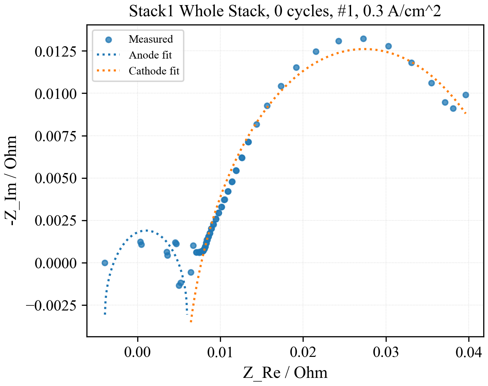
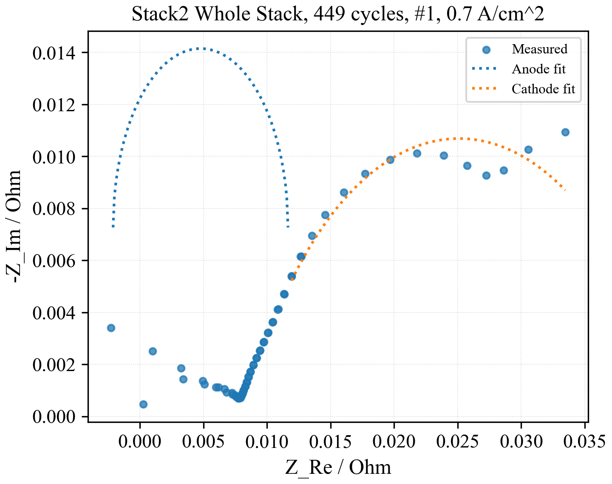
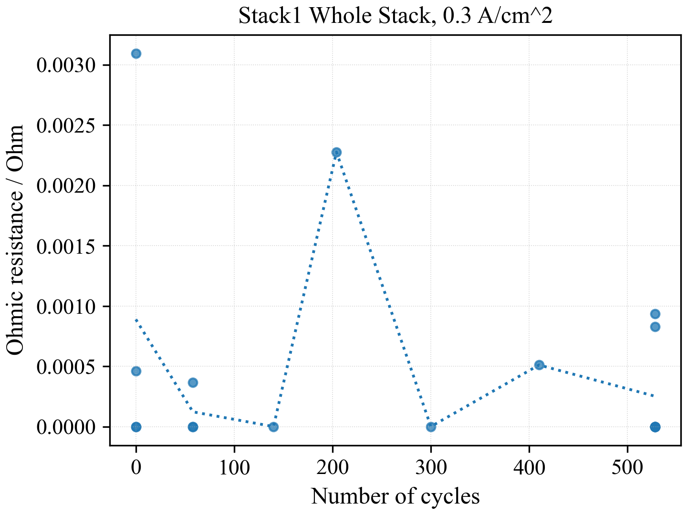
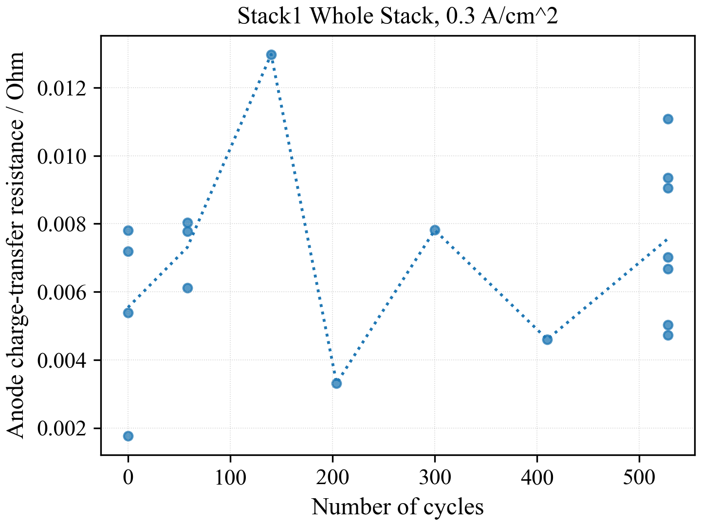
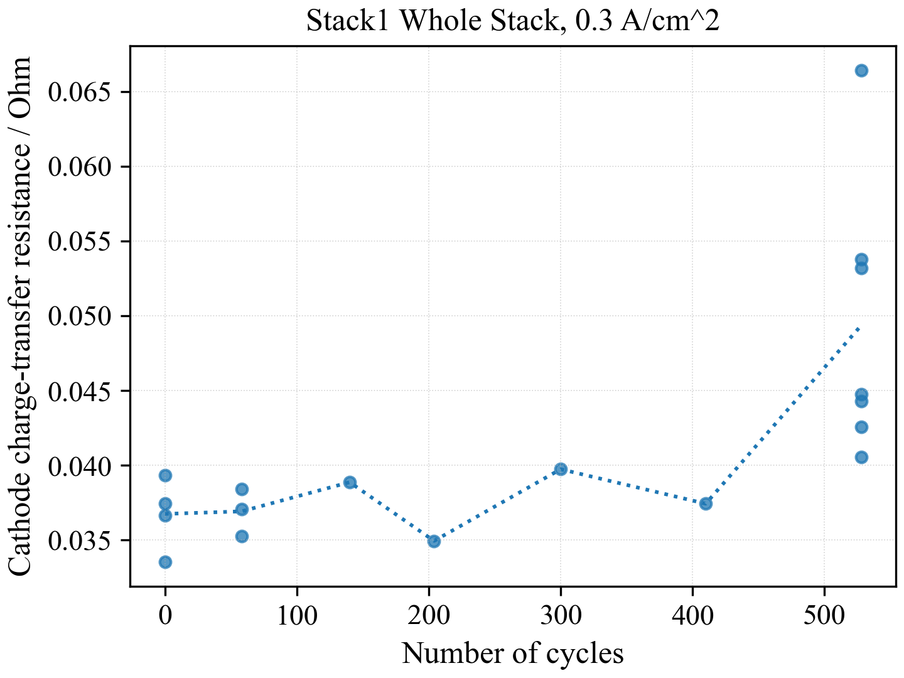
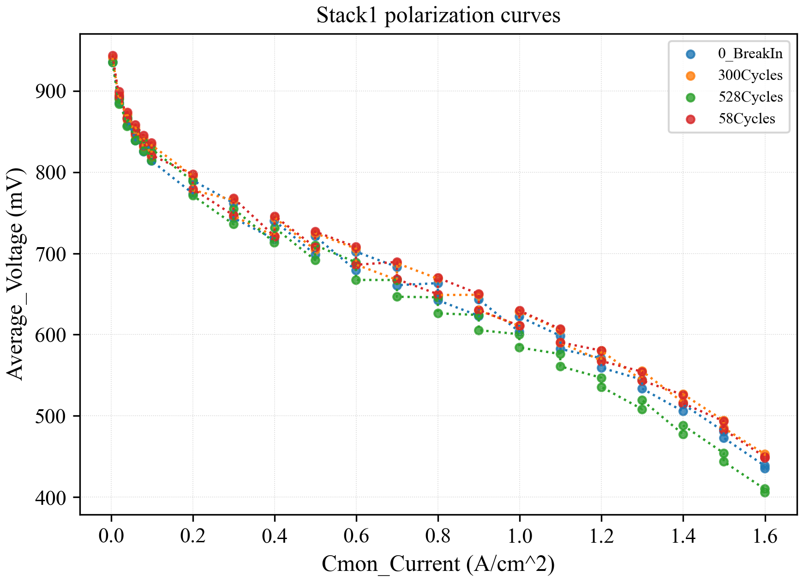
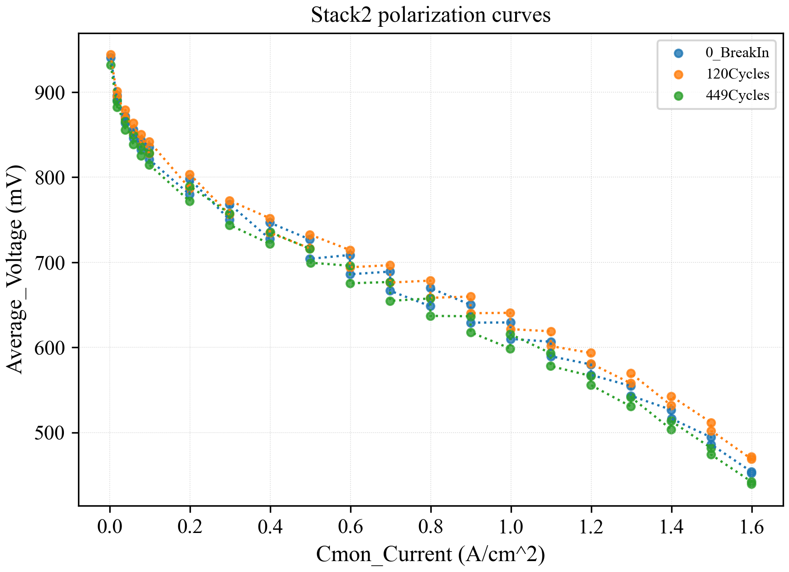

# Realistic Accelerated Stress Tests for PEM Fuel Cells

This repository contains the RealAgeing PEMFC dataset and a reproducible analysis workflow for EIS fitting, resistance tracking, and polarization-curve visualization.

## Repository Structure

```text
data/     Original dataset files, preserved without editing.
code/     Reproducible Python analysis scripts.
results/  Generated summary tables and figures.
```

The `data/` folder is intentionally flat at the repository level:

```text
data/
  FileNameCode.txt
  OperatingParameters.xlsx
  Stack1/
  Stack2/
```

## Quick Analysis

Run the full analysis from the repository root:

```bash
python code/main.py
```

The script reads all Excel files under `data/` and writes regenerated outputs to `results/`.

## Key Results

EIS resistance values are estimated by splitting each Nyquist arc into two semicircle regions and fitting one least-squares circle to each region. The split point is selected by scanning candidate boundaries and choosing the two-circle fit with the lowest residual error.

| Stack | Current density (A/cm^2) | R_ohm (Ohm) | R_anode_ct (Ohm) | R_cathode_ct (Ohm) |
| --- | ---: | ---: | ---: | ---: |
| Stack1 | 0.3 | 0.000470 | 0.006984 | 0.041900 |
| Stack1 | 0.7 | 0.000000 | 0.018570 | 0.040139 |
| Stack1 | 1.0 | 0.000000 | 0.025012 | 0.051191 |
| Stack2 | 0.3 | 0.000732 | 0.007052 | 0.039567 |
| Stack2 | 0.7 | 0.000057 | 0.016749 | 0.037884 |

Full fitted values are saved in `results/tables/eis_fit_parameters.csv` and `results/tables/eis_fit_parameters.xlsx`.

## Figures

All figures use scatter markers plus dotted fit or guide lines. Axis labels follow the original dataset column names where applicable, and Matplotlib is configured to use Times New Roman.

### Representative EIS Fits

#### Stack1, 0 cycles, condition 1, 0.3 A/cm^2



#### Stack2, 449 cycles, condition 1, 0.7 A/cm^2



### Resistance Trends

#### Stack1 whole-stack ohmic resistance, 0.3 A/cm^2



#### Stack1 whole-stack anode charge-transfer resistance, 0.3 A/cm^2



#### Stack1 whole-stack cathode charge-transfer resistance, 0.3 A/cm^2



### Polarization Curves

#### Stack1 average-voltage polarization curves



#### Stack2 average-voltage polarization curves



## Output Inventory

- `results/figures/eis_fits/`: individual EIS Nyquist plots for every stack, sheet, cycle, condition, and current density.
- `results/figures/eis_trends/`: individual resistance trend plots, one resistance component per image.
- `results/figures/polarization_curves/`: polarization curves and voltage trend figures.
- `results/tables/eis_fit_parameters.csv`: fitted EIS resistance parameters.
- `results/tables/polarization_curve_points.csv`: cleaned polarization-curve points.
- `results/tables/representative_eis_figures.csv`: representative whole-stack EIS figure paths.

## EIS Filename Numbering

The numbering in files such as `Real_Ageing_EIS-1-0_3.xlsx` is the operating-condition reference number, not a replicate index. The mapping is defined in `data/OperatingParameters.xlsx`.

For the 0-cycle EIS files containing conditions `1`, `2`, `6`, and `7`:

| Condition | Temperature (C) | Air pressure (bar) | Air RH (%) | Air stoichiometry |
| --- | ---: | ---: | ---: | ---: |
| 1 | 60 | 1.50 | 70 | 2 |
| 2 | 60 | 1.75 | 70 | 2 |
| 6 | 60 | 1.25 | 70 | 2 |
| 7 | 60 | 1.25 | 70 | 3 |

## Dataset Notes

Project name: RealAgeing

- `PC`: polarization curve
- `EIS`: electrochemical impedance spectroscopy
- `BreakIn`: directly after break-in; no cycles driven yet
- `xxCycles`: after `xx` cycles
- EIS current density is encoded in the filename, for example `0_3`, `0_7`, or `1_0`.

## Citation

This is the dataset to the published article "Realistic accelerated stress tests for PEM fuel cells: Test procedure development based on standardized automotive driving cycles" (DOI: 10.1016/j.ijhydene.2023.08.292).

Please cite:

P. Thiele, Y. Yang, S. Dirkes, M. Wick, S. Pischinger, Realistic accelerated stress tests for PEM fuel cells: Test procedure development based on standardized automotive driving cycles, International Journal of Hydrogen Energy 52 (Part D) (2024) 1065-1080, https://doi.org/10.1016/j.ijhydene.2023.08.292.

## Source

- https://zenodo.org/records/13166135

